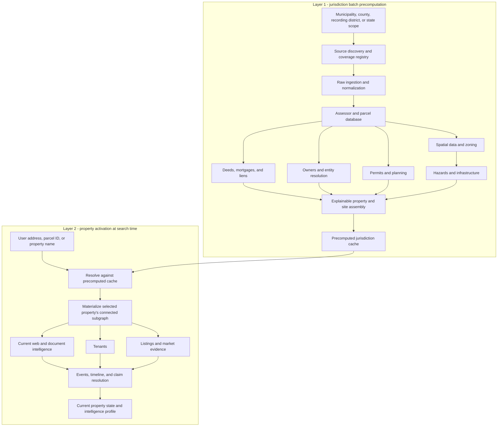

# DealSynq property-intelligence architecture

The system has two execution layers. It does not wait for a user to search an
address before collecting every source, and it does not run expensive,
property-specific web research for every parcel in advance.

## Why the existing implementation was preserved

The earlier single-property pipeline already provided the correct evidence
model, provenance rules, incremental fingerprints, contradiction handling,
claim resolution, reports, and validation. Those components remain the
property activation/output layer. The new municipality layer sits in front of
it and populates a reusable cache before a search occurs.

Deleting the earlier code would discard tested evidence logic. Keeping only the
earlier address-first orchestration, however, would repeatedly collect the same
assessor, parcel, deed, permit, zoning, and hazard records. The two-layer design
reuses the tested core while changing when and at what scope collection occurs.

## Execution modes

The 25 semantic stages declare one of three modes:

- `batch`: jurisdiction-wide collection and normalization before user search.
- `on_demand`: current, property-specific work after an address is activated.
- `materialize`: combine batch and on-demand evidence into the property
  timeline, resolved claims, current state, and final profile.

The batch engine catalog covers assessor, parcel/GIS, zoning, owners/entities,
deeds, mortgages/liens, site assembly, permits/planning, hazards, and optional
infrastructure. Tenants, listings/market, current web intelligence, and
property-specific documents run on demand by default.

## Collection scopes are explicit

There is no assumption that every source is statewide. A scope can be a
municipality, county, recording district, or state. For example, an assessor
may be municipal, deeds may be maintained by a county or recording district,
and flood data may be national. A deployer can run overlapping scopes and
connect their outputs through jurisdiction-scoped identifiers.

## Tool-agnostic collection boundary

`municipality-evidence-bundle/1.0.0` is the neutral batch interchange contract.
An approved collector may use an API, bulk download, GIS service, database
export, lawful browser-assisted review, or a vendor integration. It emits
properties, entities, aliases, facts, relationships, site memberships, temporal
states, events, gaps, sources, and raw provenance. The batch orchestrator does
not contain Five Town Plaza, Springfield, SEC, or source-vendor logic.

The existing `CollectionAdapter` contract remains the property-level adapter
boundary. Current web search uses a separate replaceable provider contract.
Neither layer bypasses logins, CAPTCHAs, paywalls, or prohibited access
controls. LoopNet material is validation-only.

`arcgis_context` is one implementation of that boundary. It accepts configured
FeatureServer or MapServer layers, queries them against the official activated
site geometry, and emits raw payloads, sources, facts, optional graph entities,
events, temporal states, and capability updates. The implementation is
jurisdiction-neutral; source disclaimers and screening limits travel with each
configured layer.

## Evidence and claim policy

Each observation retains its source URL, source/retrieval dates, raw hash,
parser version, locator, confidence, freshness, and one fact class:

- `confirmed_official`
- `reported`
- `calculation`
- `inference`
- `prediction`

Alternatives are retained. Claim resolution selects a preferred current value
without deleting conflicting facts. Predictions never masquerade as official
or calculated facts.

## Coverage is not the same as software availability

Every batch engine records `complete`, `partial`, `blocked`, `missing`, or
`not_applicable`. A collection scope is complete only when every required engine
has a `complete` or justified `not_applicable` outcome. This is a coverage
contract, not a claim that unavailable public data exists.

A successful parser run defaults to `partial`. A deployment may claim
`complete` only by configuring a human-reviewable `completion_basis` (for
example, a publisher's full bulk release and row-count reconciliation). This
prevents "the request returned HTTP 200" from being mistaken for complete
jurisdiction coverage.

The 25 semantic property stages separately record:

- `implementation_status`: whether the reusable software contract exists.
- `coverage_status`: whether the activated property has sufficient evidence.

## Incremental behavior

Each scope engine fingerprints its parser, configuration, and input files.
Successful fingerprints are retained in `scope_engine_runs`; unchanged reruns
are skipped. Raw evidence remains content-addressed. Property activation copies
only the selected property's connected subgraph into its own database, then
runs the on-demand engines incrementally.

When several engine contracts are satisfied by one collector, `coverage_from`
reuses that collector's persisted output profile. An unchanged jurisdiction
run therefore validates downstream contracts without rereading the source or
rescanning the full evidence graph. Any collector execution invalidates the
in-memory profile cache before later contracts are evaluated.

Derived measurements use predicates that identify their method. In particular,
publisher-supplied `parcel_geometry_union_area` is distinct from the
equal-area, CRS-projected `projected_parcel_geometry_union_area`. Unit changes
are not treated as source disagreements, while legacy derived observations are
retained as superseded history.

## Relationship to the existing DealSynq data

The municipality database is the precomputed jurisdiction cache. An activated
property database is the downstream integration payload used by the existing
reports and property profile logic. New intelligence sits alongside and links
to the same jurisdiction-scoped parcel, site, building, address, and owner
entities; it is not a separate research memo.
